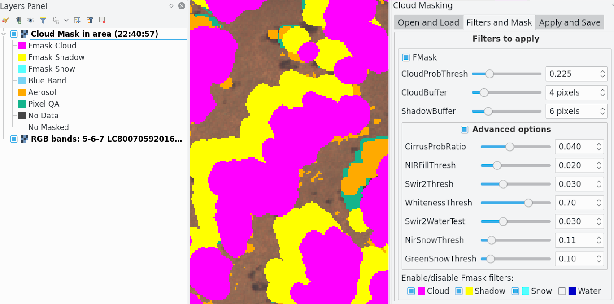

# CloudMasking

CloudMasking is a Qgis plugin for make the masking of clouds, cloud shadow, cirrus, aerosols, ice/snow and water for Landsat (4, 5, 7, 8, 9) products using different process and filters such as Fmask, Blue Band, Cloud QA, Aerosol and Pixel QA.

Read more in: [https://smbyc.github.io/CloudMasking](https://smbyc.github.io/CloudMasking)

## Motivation

There are several ways for make cloud masking automatically, such as apply the default fmask band or cloud filter using a fixed pixel values in the QA bands. But these "by default" bands and values are not always good, and their efficiency varies in different regions and depends to a great extent on the type of terrain, vegetation or environmental conditions. The purpose of the plugin is to make cloud masking very personalized and configurable to perform the best possible masking by combining and using of various bands and filters.

If you want masking in a bulk process I recommend use [python-fmask](www.pythonfmask.org) (but it is only fmask)

## Installation

The plugin can be installed using the QGIS Plugin Manager, go into Qgis to `Plugins` menu and `Manage and install plugins`, in `All` section search for `CloudMasking`.

The plugin will be available in the `Plugins` menu and `Plugins toolbar`.

## Source code

The official version control system repository of the plugin:
[https://github.com/SMByC/CloudMasking](https://github.com/SMByC/CloudMasking)

The home plugin in plugins.qgis.org: [https://plugins.qgis.org/plugins/CloudMasking/](https://plugins.qgis.org/plugins/CloudMasking/)

## Issue Tracker

Issues, ideas and enhancements: [https://github.com/SMByC/CloudMasking/issues](https://github.com/SMByC/CloudMasking/issues)

## About us

CloudMasking was developing, designed and implemented by the Group of Forest and Carbon Monitoring System (SMByC), operated by the Institute of Hydrology, Meteorology and Environmental Studies (IDEAM) - Colombia.

Author and developer: *Xavier Corredor Ll.*  
Theoretical support, tester and product verification: SMByC-PDI group

### Contact

Xavier Corredor Ll.: *xcorredorl (a) ideam.gov.co*  
SMByC: *smbyc (a) ideam.gov.co*

## License

CloudMasking is a free/libre software and is licensed under the GNU General Public License.

[www.pythonfmask.org]: www.pythonfmask.org