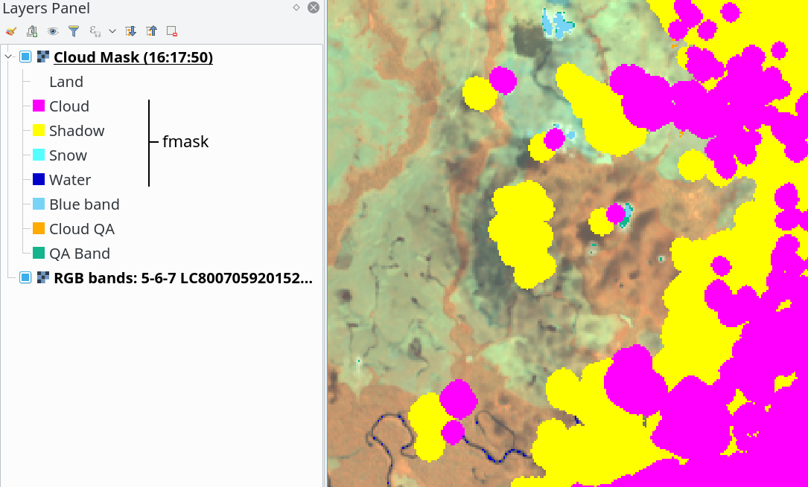
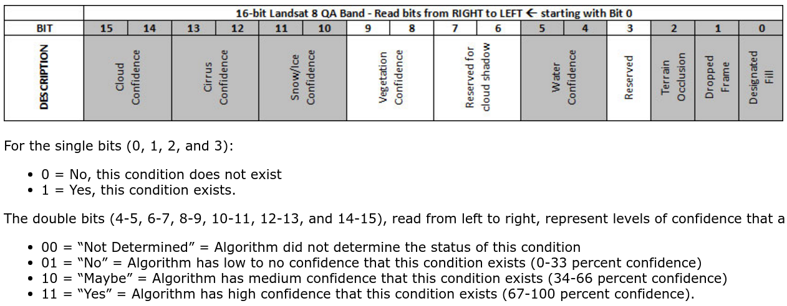
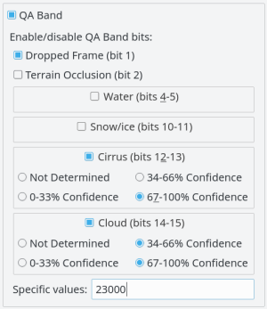

# Cloud filters

There are available four filters in the plugin, depend of the Landsat version or collection that you can use all of this filters. When you active more than one filter, the masking is accumulate from back to top (from QA Band to Fmask) and in this case some filters are cover by others (this is that one pixel is market with more than one filter)

### Fmask

The Fmask process use a python fmask implementation by  http://pythonfmask.org as a internal library in the plugin. The Fmask is a implement of the algorithms published in:

* Zhu, Z. and Woodcock, C.E. (2012). Object-based cloud and cloud shadow detection in Landsat imagery Remote Sensing of Environment 118 (2012) 83-94.

* Zhu, Z., Wang, S. and Woodcock, C.E. (2015). Improvement and expansion of the Fmask algorithm: cloud, cloud shadow, and snow detection for Landsats 4-7, 8, and Sentinel 2 images Remote Sensing of Environment 159 (2015) 269-277.

### Blue Band

This filter use the Landsat blue band for masking all pixel with values less than threshold set.

The blue band is:

* Landsat 4, 5, 7: `band 1`
* Landsat 8: `band 2`

The threshold range depend of the Landsat version:

* Landsat 4, 5, 7: `0-255` (8bits)
* Landsat 8: `0-65534` (16bits)

### Cloud QA

The cloud QA are available for only SR Landsat collection. The SR (Surface Reflectance) is a special Landsat collection with more and adjusted products than the raw Landsat products. You can download it from https://espa.cr.usgs.gov/ordering/new

The Cloud QA is a band of 8 bits, usually the filename ends in `*_sr_cloud.tif`. These 8 bits are:

For more information consult the [product guide](http://landsat.usgs.gov/documents/provisional_lasrc_product_guide.pdf)

In the plugin is implemented this filter bit a bit (only the useful bits) and you can enable one or more than one bits, there is also the option for filter `specific decimal` values but applied as a binary value.

When multiple bits are selected (and/or specific values) the plugin marked all pixels for each bit selected individually (and not the unique value which these represent together). For example, if cirrus (bit 0) and cloud (bit 1) is selected, first market all pixels that have cirrus regardless of the other values, after do the same with cloud.

### QA Band

The QA Band are available for only SR Landsat collection. The SR (Surface Reflectance) is a special Landsat collection with more and adjusted products than the raw Landsat products. You can download it from https://espa.cr.usgs.gov/ordering/new

The QA Band is a band of 16 bits, usually the filename ends in `*_qa.tif` or `*_bqa.tif`. These 16 bits are:

For more information consult the [product guide](http://landsat.usgs.gov/qualityband.php)

In the plugin is implemented this filter bit a bit (only the useful bits) and you can enable one or more than one bits, there is also the option for filter `specific decimal` values but applied as a binary value.

When multiple bits are selected (and/or specific values) the plugin marked all pixels for each bit selected individually (and not the unique value which these represent together). For example, if cirrus 67-100% (bits 12 and 13) and cloud 67-100% (bits 14 and 15) is selected, first market all pixels that have cirrus (bits 12 and 13) regardless of the other values, after do the same with cloud (bits 14 and 15).