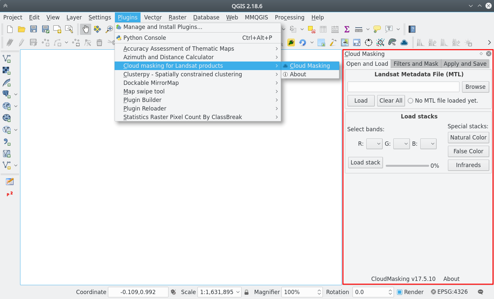
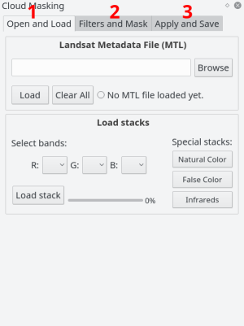
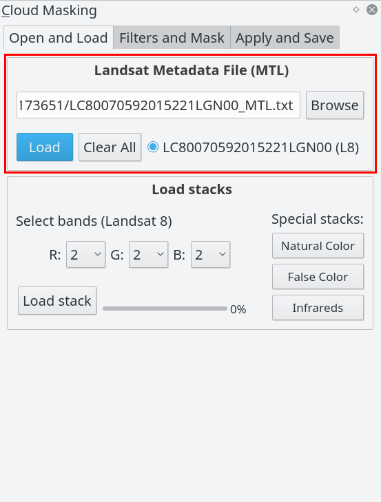
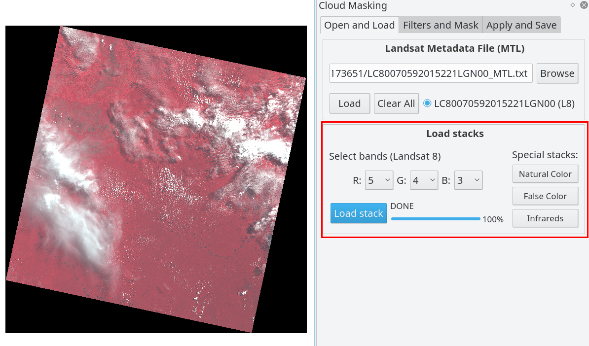
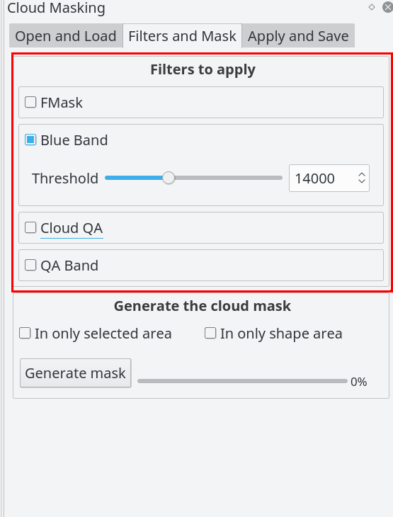
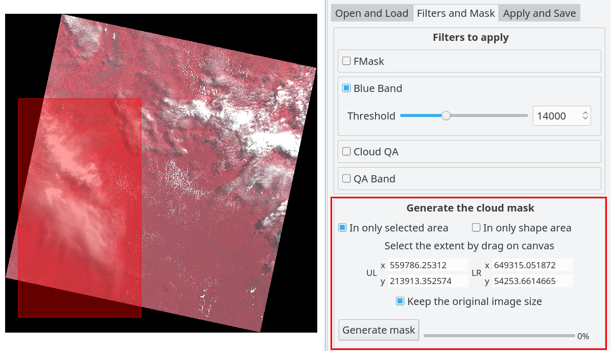
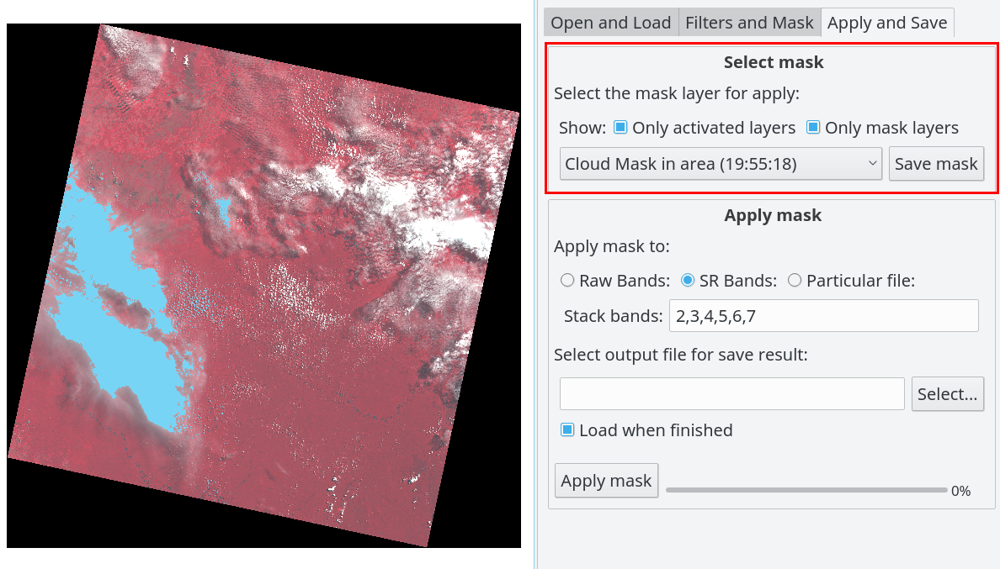

# How to use

This is a mini guide step by step for use the CloudMasking plugin

### Active the plugin

When activate the plugin, it is load as a dockwidget plugin locate in the right position in Qgis by default:

### Order to use the plugin

The plugin is divided and ordered by three sections; `(1) Open and Load` this is for open the MTL file and load the stack, `(2) Filters and Mask` for enable and configure the filters for apply cloud masking and `(3) Apply and Save` for save the mask and apply the mask to stack:

### 1a. Browse and load the MTL file

The fists step you need to load a MTL file, click in `Browse` and `Load` for read the MTL file, when the MTL file is loaded the others widgets of the plugin is activated for use:

### 1b. Load stacks (optional)

The `Load stacks` section you can make and open in Qgis the stack in RGB bands combination as you want for visualize and check the Landsat image, in the right side you can access for special stacks (more uses) RBG bands order, you need to do click in `Load stack` bottom for make and load the stack configured. This is not necessary for process only for view:

### 2a. Select the filters to apply

The plugin have a four different filters to apply, the `Fmask` and `Blue Band` are available for all Landsat, but the `Cloud QA` and `QA Band` are available for only SR Landsat collection (see more in [Cloud Filters](cloud_filters.md)). You can activate more than one filter at a time, the plugin accumulate the filters in the same order (bottom up).

Please see the [cloud filters](cloud_filters.md) for more information about it.

### 2b. Generate the cloud mask

In this section you can generate the mask with the filters enabled, there are three options for generate the mask:

- `In the whole image` (by default) if the two options _selected in area_ and _shape area_ are disabled, the mask will process in whole image

- `In only selected area` (optional) if you selected this option you can process the mask in a specific area selected drawing in the canvas (only a rectangle area)

    - If the option `Keep the original image size` is enabled, the result mask will be with the same extent, else the result mask will be clipping in the area selected

- `In only shape area` (optional) with this option you can process the mask only inside the particular shape, you need create it before apply

    - If the option `Delete data outside the shape` is enabled, the result mask will have the same extent but the data outside the sahep will be masked, else the result mask will have the same and the data outside the shape will be valid (only masked inside the shape)

### 3a. Select the mask to apply

In this section you must select the mask to apply or save it, there are two checkbox for help to find the mask in the list: `Only activated layers` and `Only mask layers`. You can save the mask selected with the buttom `Save mask`

### 3b. Apply mask

The plugin help for make, apply and save the stacks with the Landsat loaded, there are three options for which stack will be used for apply the mask:

- `Raw Bands`, these are the original bands of the Landsat products, you can select the order band for make the stack, by default are the reflectance bands

- `SR Bands`, these are the Surface Reflectance (SR) Landsat products by ESPA, this option is enable only if you are processing this type of product, and you can select the order band for make the stack, by default are the reflectance bands

- `Particular file`, the last option is apply to a particular stack or image file

Finally you must the select the output file to save and `Apply mask`

