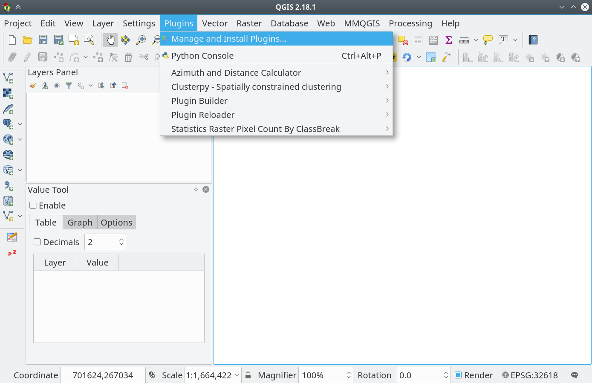
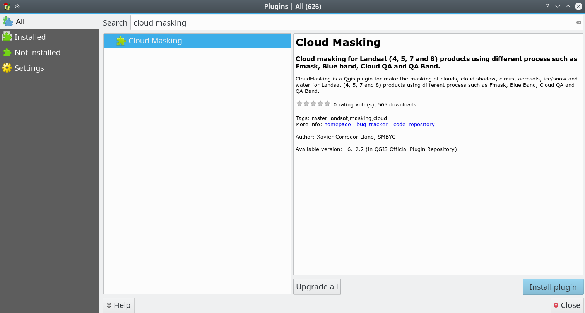
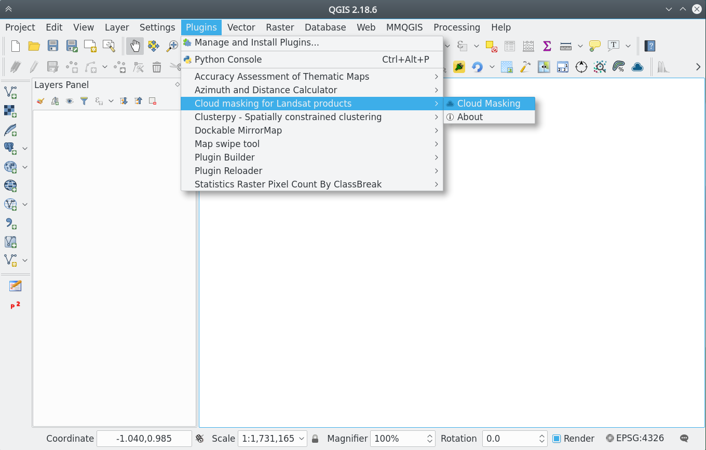
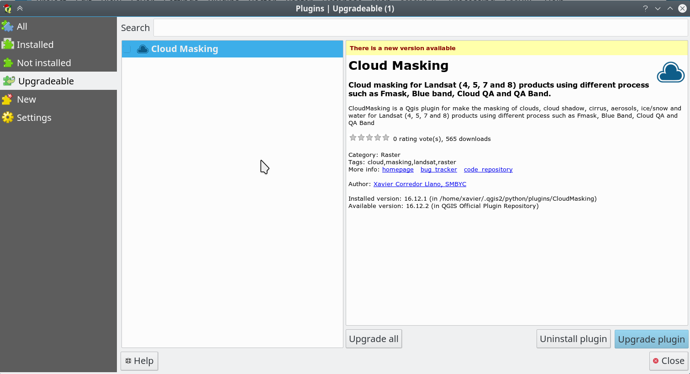

# Installation

The plugin can be installed using the QGIS Plugin Manager:

- Go into Qgis to `Plugins` menu and `Manage and install plugins`

    

- In `All` section search for `Cloud Masking` click and press Install plugin

    

- The plugin will be available in the `SMBYC` menu

    

# Upgrade

For upgrade the plugin to a new version:

- Go into Qgis to `Plugins` menu and `Manage and install plugins` and click in `Upgradeable` _(if not exists this item is because there are not new versions for all plugins installed)_:

    

    Windows users: For some reason (with a dll library in the plugin) the update in windows has problems. For update: first uninstall the plugin or delete manually the plugin directory and then install it.